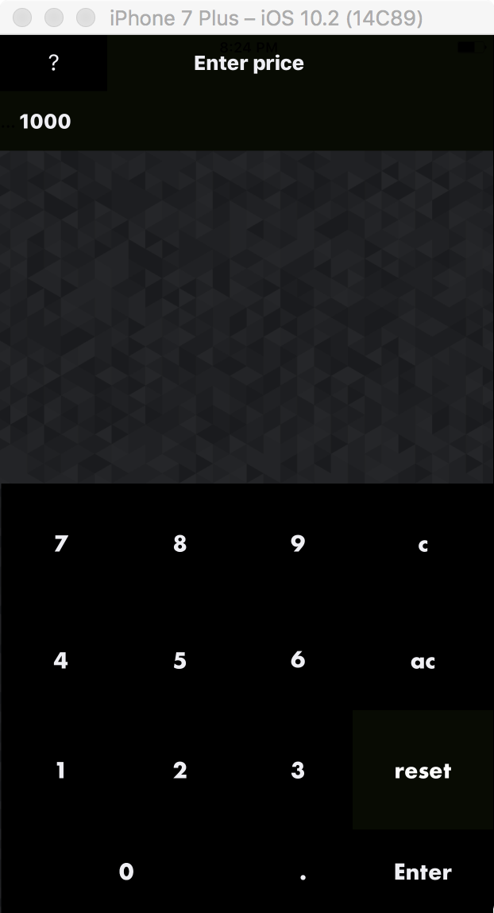
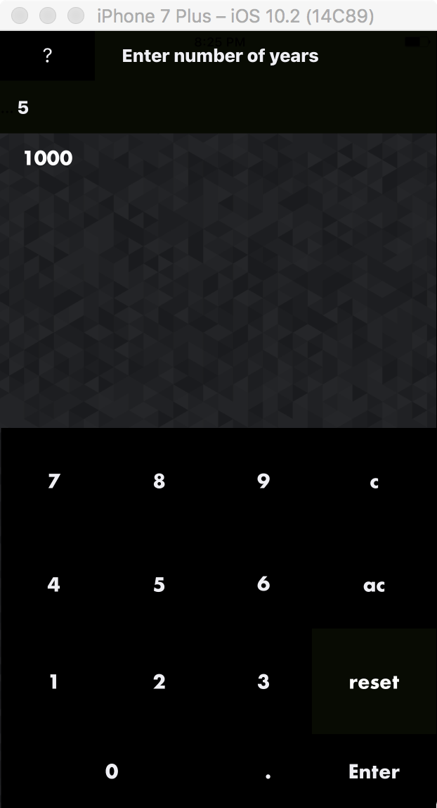

# Compound Interest App

A simple app for calculating compound interest. My main focus was creating a good user interface and a simple tool for calculation.

* The app walks you through the calculation with clear prompts and display
* The user interface resembles a normal calculator but only has necessary buttons

Price of Initial Object Entry

Number of Years of interest

Proportion Compounded

Interest Rate

And Finally the result

